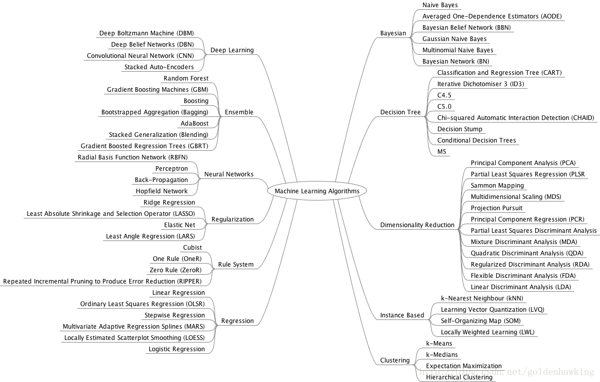

# Mad-Learning

> The definition of knowing something is being able to explain it clearly. - S. Salsa

This repository is created for studying **Machine Learning**, by exchanging notes, codes, and more important, **ideas**. All forms of contribution are grateful; Besides, all the collaborators have **root** permission to this repository.

## Map of Machine Leaning

## Contents of Repository

- Preliminary Knowledge
  - [Karush-Kuhn-Tucker Conditions](/KKT)
  - Spetral Decomposition of Symmetric Matrix
  - ...

- Supervised Learning
  - [Linear Regression](/LINEAR-REGRESSION)
  - [Lasso/Ridge Regression](/LRR)
  - [Principal Components Analysis](/PCA)
  - [Statistical Discrimination and Classification](/LDA-QDA)
  - [Support Vector Machine](/SVM)
  - ...

- Unsupervised Learning
  - ...

- [Reinforcement Learning](/RL)
  - [Multi Agent](/RL/Multi-agent)

## References

1. Trevor Hastie et. al., The Elements of Statistical Learning (2nd Edition), Springer, 2008.

2. 李航, 统计学习方法, 清华大学出版社, 2012.

3. Johnson, R.A. and Wichern, D.W., Applied Multivariate Statistical Analysis (6th Edition), Prentice Hall, 2007.

4. Sheldon Axler, Linear Algebra Done Right (2nd Edition), Springer, 1997.

5. David G. Luenberger, Yinyu Ye, Linear and Nonlinear Programming (3rd Edition), Springer, 2008.
