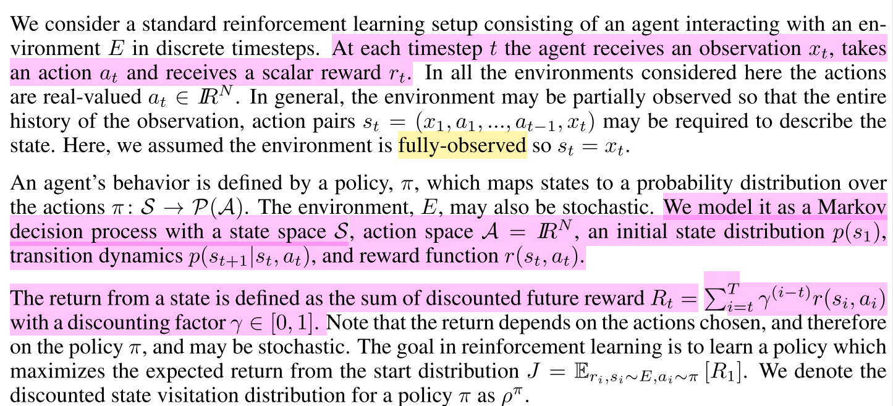

---

typora-copy-images-to: img
---

## 马尔可夫决策过程MDP

### 马尔可夫模型的几类子模型

各种马尔可夫子模型的关系:

|                |     不考虑动作      |              考虑动作               |
| :------------: | :-----------------: | :---------------------------------: |
|  状态完全可见  |   马尔科夫链(MC)    |        马尔可夫决策过程(MDP)        |
| 状态不完全可见 | 隐马尔可夫模型(HMM) | 不完全可观察马尔可夫决策过程(POMDP) |

### 马尔可夫决策过程

一个马尔可夫决策过程由一个四元组构成$M = (S, A, P_{sa}, 𝑅)$ [注1]

- S: 表示状态集(states)，有$s∈S$，$s_i$表示第i步的状态。
- A:表示一组动作(actions)，有$a∈A$，$a_i$表示第i步的动作。
- $𝑃_{sa}$: 表示状态转移概率。𝑃s𝑎 表示的是在当前$s ∈ S$状态下，经过$a ∈ A$作用后，会转移到的其他状态的概率分布情况。比如，在状态s下执行动作$a$，转移到m的概率可以表示为$p(s'|s,a)$。
- $R: S×A⟼ℝ$ ，R是回报函数(reward function)。有些回报函数状态$S$的函数，可以简化为$R: S⟼ℝ$。如果一组$(s,a)$转移到了下个状态$s'$，那么回报函数可记为$r(s'|s, a)$。如果$(s,a)$对应的下个状态s'是唯一的，那么回报函数也可以记为$r(s,a)$。

MDP 的动态过程如下：某个智能体(agent)的初始状态为$s_0$，然后从 A 中挑选一个动作$a_0$执行，执行后，agent 按$P_sa$概率随机转移到了下一个$s1$状态，$s1∈P_{s_0a_0}$。然后再执行一个动作$a_1$，就转移到了$s_2$，接下来再执行$a_2$…，我们可以用下面的图表示状态转移的过程。

如果回报r是根据状态s和动作a得到的，则MDP还可以表示成下图：

### 值函数(value function)

增强学习学到的是一个从环境状态到动作的映射（即行为策略），记为策略π: S→A。而增强学习往往又具有延迟回报的特点: 如果在第n步输掉了棋，那么只有状态sn和动作an获得了立即回报r(sn,an)=-1，前面的所有状态立即回报均为0。所以对于之前的任意状态s和动作a，立即回报函数r(s,a)无法说明策略的好坏。因而需要定义值函数(value function，又叫效用函数)来**表明当前状态下策略π的长期影响**。

1. 状态值函数(state value function)

   - 
   - 
   - 

   其中：

   a)是采用策略π的情况下未来有限h步的期望立即回报总和；

   b)是采用策略π的情况下期望的平均回报；

   c)是值函数最常见的形式，式中γ∈[0,1]称为折合因子，表明了未来的回报相对于当前回报的重要程度。特别的，γ=0时，相当于只考虑立即不考虑长期回报，γ=1时，将长期回报和立即回报看得同等重要。

   **重点看第三个式子**

   

   给定策略π和初始状态s，则动作a=π(s)，下个时刻将以概率p(s'|s,a)转向下个状态s'，那么上式的期望可以拆开，可以重写为：

   

   **注意：**在$V^π(s)$中，π和初始状态s是我们给定的，而初始动作a是由策略π和状态s决定的，即a=π(s)。

2. 动作值函数(action value functionQ函数)

   

   给定当前状态s和当前动作a，在未来遵循策略π，那么系统将以概率p(s'|s,a)转向下个状态s'，上式可以重写为：

   

   **在$Q^π(s,a)$中，不仅策略π和初始状态s是我们给定的，当前的动作a也是我们给定的，这是$Q^π(s,a)$和$V^π(a)$的主要区别。**

在得到值函数后，即可列出MDP的最优策略：

即我们的目标是寻找的是在任意初始条件s下，能够最大化值函数的策略π*。

**[一个优秀的例子](https://www.cnblogs.com/jinxulin/p/3517377.html)**

## MDP的动态规划解法

基本的解法有三种：

- 动态规划法(dynamic programming methods)
- 蒙特卡罗方法(Monte Carlo methods)
- 时间差分法(temporal difference)

本文先介绍动态规划法求解MDP

### 贝尔曼方程（Bellman Equation）

$V^\pi$和$Q^\pi$的表达式总结如下：

在动态规划中，上面两个式子称为**贝尔曼方程**，它表明了**当前状态的值函数与下个状态的值函数的关系**  。

优化目标$π^*$可以表示为：

分别记最优策略$π$对应的状态值函数和动作值函数为 $V^*(s)$ $和$$Q^*(s, a)$

状态值函数和行为值函数分别满足如下**贝尔曼最优性方程(Bellman optimality equation)**：

故可知，$V^*(s)$ $和$$Q^*(s, a)$存在如下关系：

### 策略估计(Policy Evaluation)

对于任意的策略π，我们如何计算其状态值函数$V^π(s)$？

**确定性策略**：（上一节主è¦ä»‹ç»çš„就是确定性策略）

**扩展到一般**：如果在某策略π下，π(s)对应的动作a有多种可能，每种可能记为π(a|s)，则状态值函数为

一般采用迭代的方法更新状态值函数，首先将所有Vπ(s)的初值赋为0（其他状态也可以赋为任意值，不过吸收态必须赋0值），然后采用如下式子更新所有状态s的值函数（第k+1次迭代）：

对于$V^π(s)$，有**两种更新方法**：

1. 将第k次迭代的各状态值函数 $[V_k(s1),V_k(s2),V_k(s3), \dots]$ 保存在一个数组中，第k+1次的Vπ(s)采用第k次的$V^π(s')$来计算，并将结果保存在第二个数组中。
2. 即仅用一个数组保存各状态值函数，每当得到一个新值，就**将旧的值覆盖**,形如$[V_{k+1}(s1),V_{k+1}(s2),V_k(s3), \dots]$，第k+1次迭代的$V^π(s)$可能用到第k+1次迭代得到的$V^π(s')$。

通常情况下，我们**采用第二种方法更新数据**，因为它及时利用了新值，能更快的收敛。整个策略估计算法如下图所示：

### 策略改进(Policy Improvement) (策略择优)

假设我们有一个策略$π$，并且确定了它的所有状态的值函数$V^π(s)$。对于某状态s，有动作$a_0=π(s)$。 那么如果我们在状态s下不采用动作$a_0$，而采用其他动作$a≠π(s)$是否会更好呢？要判断好坏就需要我们计算行为值函数$Q^π(s,a)$，公式我们前面已经说过：

**评判标准**是：$Q^π(s,a)$是否大于$V^π(s)$。如果$Q^π(s,a)$> $V^π(s)$，那么至少说明新策略【仅在状态s下采用动作a，其他状态下遵循策略π】比旧策略【所有状态下都遵循策略π】整体上要更好。

**策略改进定理(policy improvement theorem)**：$π$和$π'$是两个确定的策略，如果对所有状态$s∈S$有$Q^π(s,π'(s))≥V^π(s)$，那么策略π'必然比策略π更好，或者至少一样好。其中的不等式等价于$V^{π'}(s)≥V^π(s)$。

有了在某状态s上改进策略的方法和策略改进定理，我们可以遍历所有状态和所有可能的动作a，并采用贪心策略来获得新策略$π'$。即对所有的$s∈S$, 采用下式更新策略：

这种采用关于值函数的贪心策略获得新策略，改进旧策略的过程，称为策略改进(Policy Improvement)

贪心策略收敛:

> 假设策略改进过程已经收敛，即对所有的s，Vπ'(s)等于Vπ(s)。那么根据上面的策略更新的式子，可以知道对于所有的s∈S下式成立:
>
> 

这个式子正好就是我们在1中所说的Bellman optimality equation，所以π和π'都必然是最优策略！神奇吧！

## 强化学习

### 分类

1. - 不理解环境(Model-free RL)

     Q Learning、Sarsa、Policy Gradients

   - 理解环境(Model-Based RL)

     相较于Model-free，Model-Based可以构建虚拟环境，并且可以**想象**

2. - 基于概率(Policy-Based RL)：输出的是概率，不一定选择最高概率的，适用于连续动作：Policy Gradients
- 基于价值(Value-Based RL)：输出的是价值，一定选择价值最高的动作：QLearning、Sarsa
   - Actor-Critic：Actor基于概率做出动作，Critic再基于价值给出动作的价值
   

3. - 回合更新(Monte-Carlo update)：游戏结束更新

     基础版Policy Gradients

   - 单步更新(Temporal-Difference update)：游戏进行的每一步都可以更新

     Q Learning、Sarsa、升级版Policy Gradients

4. - 在线学习(On-Policy)

     Sarsa、Sarsa($\lambda$)

   - 离线学习(Off-Policy)

     Q Learning、DQN

### Q Learning 

根据$Q$表对下一时刻的动作进行选择，下图是$Q$表的更新方式

此时，$S_2$并未进行下一次的动作，而是预估了一下后果，由此来更新$S_1$的$Q$表。

其中，$\alpha$是**学习速率**，$\epsilon$是**选择$Q$表最大值的概率**。若$\epsilon=90\%$，则$90\%$概率选择$Q$表最大值即最优动作，$10\%$的概率随机动作。

由于$Q(s',a')$是下一次的动作，会通过乘以**奖励衰减值**$\gamma$的方式影响前一次的$Q$表取值，因此很容易想到只要$\gamma\neq 0$，以后的每次动作得到的奖励值都会影响之前动作的$Q$表取值。

- Q估计：$s_1$状态最优动作$a$的Q值
- Q现实：在选择了动作$a$后，进入 $s'$状态。Q表中 $s'$状态对应的Q值的最大值加上执行动作$a$之后得到的奖励值$r$，即
- 为Q现实。

### Sarsa

1. 决策部分与Q Learning一样
2. 区别在于Q表的更新方式：
   - Q Learning并没有实际进行下一次的动作，**会选择有危险的动作**，因此是离线学习；
   - Sarsa是实践派，进行了实际的下一步动作，**会避免选择有危险的动作**，因此是在线学习；

### Sarsa($\lambda$)

1. **不仅更新离奖励最近的一步，还更新来时沿途的每一步**

   > Sarsa 是一种单步更新法, 在环境中每走一步, 更新一次自己的行为准则, 我们可以在这样的 Sarsa 后面打一个括号, 说他是 Sarsa(0), 因为他等走完这一步以后直接更新行为准则. 如果延续这种想法, 走完这步, 再走一步, 然后再更新, 我们可以叫他 Sarsa(1). 同理, 如果等待回合完毕我们一次性再更新呢, 比如这回合我们走了 n 步, 那我们就叫 Sarsa(n). 为了统一这样的流程, 我们就有了一个 $\lambda$ 值来代替我们想要选择的步数, 这也就是 Sarsa($\lambda$) 的由来. 

2. 更新沿途存在的**问题**：会记录不必要的重复步骤，因此需要Sarsa($\lambda$)

3. $\lambda$ 的**含义**：

   

   $\lambda$是一个**衰变值**，在$0-1$之间，离奖励越远的步对到达奖励的影响越小，衰减越大；反之，离奖励越近的步对奖励的影响越大，衰减较小。

   

4. **算法**：

### DQN(Deep Q Network)

1. 抛弃Q表这种Q值记录方式，使用神经网络生成Q值，在状态较多的情况下格外有效率

2. - Q估计：通过NN预测出的$Q(s_2, a_1), Q(s_2,a_2)$的最大值
   - Q现实：Q 估计中最大值的动作来换取环境中的奖励 reward+$\gamma*$下一步$s'$中通过NN预测出的$Q(s‘, a_1), Q(s',a_2)$的最大值
3. **DQN两大利器**：
   - Experience replay: 作为一种离线学习，每次 DQN 更新的时候，我们都可以随机抽取一些之前的经历进行学习。随机抽取这种做法打乱了经历之间的相关性，也使得神经网络更新更有效率。
   - Fixed Q-target: 在 DQN 中使用到两个结构相同但参数不同的神经网络, 预测 Q 估计的神经网络具备最新的参数, 而预测 Q 现实的神经网络使用的参数则是很久以前的.
4. **算法**：

- 记忆库 (用于重复学习)
- 神经网络计算 Q 值
- 暂时冻结 `q_target` 参数 (切断相关性)

### Double DQN

因为我们的神经网络预测 `Qmax` 本来就有误差, 每次也向着最大误差的 `Q现实` 改进神经网络, 就是因为这个 `Qmax` 导致了 overestimate. 所以 Double DQN 的想法就是引入另一个神经网络来打消一些最大误差的影响. 而 DQN 中本来就有两个神经网络, 我们何不利用一下这个地理优势呢. 所以, 我们用 `Q估计` 的神经网络估计 `Q现实` 中 `Qmax(s', a')` 的最大动作值. 然后用这个被`Q估计` 估计出来的动作来选择 `Q现实` 中的 `Q(s')`. 总结一下:

有两个神经网络: `Q_eval` (Q估计中的), `Q_next` (Q现实中的).

原本的 `Q_next = max(Q_next(s', a_all))`.

Double DQN 中的 `Q_next = Q_next(s', argmax(Q_eval(s', a_all)))`. 也可以表达成下面那样.

对比原始和Double的cost曲线：

### Policy gradient

Policy gradient输出不是 action 的 value, 而是具体的那一个 action, 这样 policy gradient 就跳过了 value 这个阶段.

**优势：**输出的这个 action 可以是一个**连续值**, 之前我们说到的 value-based 方法输出的都是不连续的值, 然后再选择值最大的 action. 而 policy gradient 可以在一个连续分布上选取 action.

#### 算法

一种基于整条回合数据的更新

其中，$\nabla log \pi_{\theta}(s_t,a_t)v_t$表示在状态 $s$对所选动作的 $a$的吃惊度，$\pi_{\theta}(s_t,a_t)$代表 $Policy(s,a)$，其概率越小，反向的 $log(Policy(s,a))$(即 `-log(P)`) 反而越大. 如果在 `Policy(s,a)` 很小的情况下, 拿到了一个 大的 `R`, 也就是大的 `V`, 那$\nabla log \pi_{\theta}(s_t,a_t)v_t$  就更大, 表示更吃惊, (**我选了一个不常选的动作, 却发现原来它能得到了一个好的 reward, 那我就得对我这次的参数进行一个大幅修改**). 这就是吃惊度的物理意义。

### Actor Critic

结合了 Policy Gradient (Actor) 和 Function Approximation (Critic) 的方法. `Actor` 基于概率选行为, `Critic` 基于 `Actor` 的行为评判行为的得分, `Actor` 根据 `Critic` 的评分修改选行为的概率，输入的单次奖赏变成了critic输出的总奖赏增量td-error。critic建立s-Q的网络，然后根据[s, r, s_]来训练，并返回td-error。

**优势：**可以进行单步更新, 比传统的 Policy Gradient 要快.

**劣势：**取决于 Critic 的价值判断, 但是 Critic 难收敛, 再加上 Actor 的更新, 就更难收敛. 为了解决收敛问题, Google Deepmind 提出了 `Actor Critic` 升级版 `Deep Deterministic Policy Gradient`. 后者融合了 DQN 的优势, 解决了收敛难的问题. 

### DDPG(Deep Deterministic Policy Gradient )

`DDPG` 结合了之前获得成功的 `DQN` 结构, 提高了 `Actor Critic` 的稳定性和收敛性。为了体现`DQN`的思想，每种神经网络都需要再细分为两个， 

- Actor有估计网络和现实网络，估计网络用来输出实时的动作, 供actor在现实中实行。而现实网络则是用来更新价值网络系统的。
- Critic这边也有现实网络和估计网络，他们都在输出这个状态的价值，而输入端却有不同，状态现实网络这边会拿着从动作现实网络来的动作加上状态的观测值加以分析，而状态估计网络则是拿着当时Actor施加的动作当作输入。

#### 算法

## 论文

### CONTINUOUS CONTROL WITH DEEP REINFORCEMENT LEARNING

本篇文章提出了基于DPG(deterministic policy gradient)和DQN的**DDPG**算法。成功地将DQN应用到**连续动作**域，并且这是一种基于DPG的Actor-Critic、**无模型**算法。DDPG是一种端到端的算法，可以直接从原始输入数据映射到输出数据。A long-standing challenge of robotic control is to learn an action policy directly from raw sensory input such as video.

**DQN缺点：**

DQN是可以解决的问题一般要具有高维观测空间，并且其动作空间是低维且离散的。

**DQN优势：**

1. 网络是从replay buffer中离线的学习到的，这样就减小了数据间的相关性；
2. 该网络使用target-Q网络进行训练，以便在时间差异备份期间提供一致的目标。

**DDPG优势：**

可以在保持超参数和网络结构不变的情况下，从低维观测空间中鲁棒地学习到策略。

#### RL基础

1. Action-value function：

    $$
    Q^π(s_t, a_t) = E_{r_{i≥t},s_{i>t}∼E,a_{i>t}∼π} [R_t|s_t, a_t]
    $$

    表示在状态 $s_t$ 选择了动作 $a_t$ 的期望返回值，并且在此之后策略服从 $\pi$。
    
2. 贝尔曼方程中体现了状态之间的递归关系

    $$
    Q^π(s_t, a_t) = E_{r_t,s_{t+1}∼E} [r(s_t, a_t) + γ E_{a_t+1∼π} [Q^π(s_{t+1}, a_{t+1})]]
    $$

3. 如果策略是确定的，可用 $\mu : S ← A$ 来表示策略，并且这样就省去了求 $n+1$ 次期望的过程
    $$
    Q^µ(s_t, a_t) = E_{r_t,s_{t+1}∼E} [r(s_t, a_t) + γQ^µ(s_{t+1}, µ(s_{t+1}))]
    $$
    这样期望就只和环境有关，意味着可以通过迁移学习的方式从另一个随机策略 $\beta$ 中离线学习到 $Q^{\mu}$. Q-Leaning是一种经典离线学习算法，使用的是贪婪策略 $\mu(s)=\arg \max_aQ(s,a)$
    
4. DPG：The DPG algorithm maintains a parameterized **actor function µ(s|θµ)** which specifies the current policy by deterministically mapping states to a specific action. The **critic Q(s, a)** is learned using the Bellman equation as in Q-learning. The actor is updated by following the applying the chain rule to the expected return from the start distribution J with respect to the actor parameters:
    $$
    \begin{align*}
    ∇_{θ^µ}J &≈ E_{s_t∼ρ^β} [∇_{θ^µ}Q(s, a|θ^Q)|_{s=s_t,a=µ(s_t|θ^µ)}]\\
    &= E_{s_t∼ρ^β}[ ∇_aQ(s, a|θ^Q)|_{s=st,a=µ(s_t)}∇_{θ^µ}
    µ(s|θ^µ)|_{s=st}]
    \end{align*}
    $$

#### DDPG算法

对于Q-Learning这样的算法来说，非线性函数逼近是不能保证收敛性的，因此借鉴DQN用神经网络来在线逼近函数的成功案例，开发了DDPG。

One challenge when using neural networks for reinforcement learning is that most optimization algorithms assume that the samples are independently and identically distributed(IID). **Additionally, to make efficient use of hardware optimizations, it is essential to learn in mini- batches, rather than online.**

1. Problem 1 发散：

   Since the network $Q(s, a|θ^Q)$ being updated is also used in calculating the target value (equation 5), the Q update is prone to divergence. We create a copy of the actor and critic networks, $Q‘(s, a|θ^{Q’})$
    and $µ'(s|θ^{µ'})$ respectively, that are used for calculating the target values. This means that the target values are constrained to change slowly, greatly improving the stability of learning. 即使延迟更新导致了学习速度慢，但是它所带来的稳定性更加重要。

2. Problem 2 输入量范围不一致：

   Using *batch normalization* (Ioffe & Szegedy, 2015). This technique normalizes each dimension across the samples in a minibatch to have unit mean and variance. In addition, it maintains a run- ning average of the mean and variance to use for normalization during testing.

3. Problem 3 探索：

   DDPG这样的离线学习算法的好处在于，可以将探索独立于学习算法之外。我们定义一个包含噪声的动作策略：
   $$
   \mu'(s_t)=\mu(s_t|\theta_t^{\mu})+\mathcal{N}
   $$
   利用Ornstein-Uhlenbeck过程来生成惯性物理系统的探索

#### 相关问题

**Trust region policy optimization (TRPO)** (Schulman et al., 2015b), directly constructs stochastic neural network policies without decomposing problems into optimal control and supervised phases. 经过精准的调参，该方法可以近乎单调的更新，并且不需要计算动作值函数，可能因此导致数据效率下降。

**Guided policy search (GPS) ** algorithms (e.g., (Levine et al., 2015)) decomposes the problem (Actor-Critic存在的问题) into three phases that are rela- tively easy to solve: 

1. First, it uses full-state observations to create locally-linear approximations of the dynamics around one or more nominal trajectories, 
2. Then uses optimal control to find the locally-linear optimal policy along these trajectories; 
3. Finally, it uses supervised learning to train a complex, non-linear policy (e.g. a deep neural network) to reproduce the state-to-action mapping of the optimized trajectories.

**PILCO** (Deisenroth & Rasmussen, 2011) uses **Gaussian processes** to learn a non-parametric, probabilistic model of the dynamics. 但是在高维问题上不切实际。**不过深度函数逼近看起来是将强化学习应用到大型的、高维问题上的最好办法。**

还可以使用**压缩权重**或**无监督学习**的方法来从像素中学习策略(Koutn´ık et al., 2014) （两篇）

#### 不足

需要大量的训练步数才能找到解决方案。

